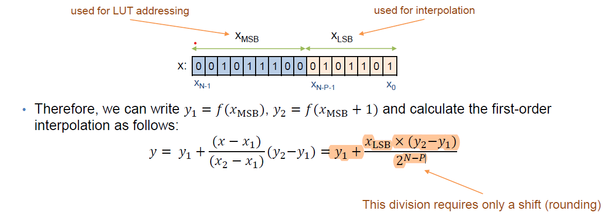

# FPGA LUT based methods

* Course: *Field Programmable Gate Array (FPGA)*
* Professor: *Dr. Mohsen Raji*
* Fall **2022/23**

## Project document

Page 1 | Page 2
:-------------------------:|:-------------------------:
 |  
<p align="center"><a href="doc/Digital System Design Project.pdf">Access the PDF</a></p>

## LUT without Interpolation (<a href="First Part/">First Part</a>)
For the first part of the project, I created a python code that generates a LUT table of function `x^2 - x^3` for x in range `(0, 1)` and the table has `256 sluts` which means we only need 8-bits so we create LUT for every possible number in 8-bits and also, they are less than 1 and bigger than 0 so we use all 8-bits as the fraction.

After generating the LUT table we only need to make a module that returns the related LUT entry based on `8-bit input`.

|  |  |
:--------------------------------------------:|:---------------------------------------------:
| RTL Schematic | Technology Schematic |

## Linear Interpolation (<a href="Second Part/">Second Part</a>)
For the second part, we must implement the function using linear interpolation using 64 slut memories so first of all, we must separate `64 entries` from the table and the choices must be in equal places so we collect every `4k` (k = 0, 1, ...) entry.

After that we need to implement the formula below inside our Verilog module.

For being able to synthesize the module on FPGA we must remove the division; the best thing is to make it into a shift division (base 2 division) so that let module gets synthesized.

|  |  |
:--------------------------------------------:|:---------------------------------------------:
| RTL Schematic | Technology Schematic |

Base on the course slides we can convert the formula to this (we know that `XLSB` is input `(8-6=)2 LSB` bits and `X2 – X1 = 2N-P = 2(8-6))`.



## Quadratic Interpolation (<a href="Third Part/">Third Part</a>)
this part required learning the quadratic method, after a little search I got a YouTube video that explained: "**Quadratic Interpolation**" ([YouTube Link](https://www.youtube.com/watch?v=BQHyEAl3-qk)).

First of all, we need a 64 slut LUT which is just like part 2. 

|  |  |
:--------------------------------------------:|:---------------------------------------------:
| RTL Schematic | Technology Schematic |

Tor implementing the formula first we need to eliminate the division so:

<p align="center"></p>

## Comparing the accuracy of step 1, 2, and 3 (<a href="test/">Test</a>)
In first part has 256 slut and also we don’t need to calculate and approximate any 8-bit input which is why the first part has the most accurate among all parts.

In the second one, we use 64 slut so the accuracy is less that the first part because we must approximate the output with the 8-bit input through the linear formula.

In the third one, we also use 64 slut like the second part but this time we use the quadratic method which means that the accuarcy is less that the 256 slut LUT method (part 1) this method needs three nodes and the accuracy is more than the second part in general but it always depends on the function.

Here is a table of the average accuracy of 19 same random inputs in all three parts:

<div align="center">


| Test No. | Input | LUT without Interpolation | Linear Interpolation | Quadratic Interpolation
:---------:|:-----:|:-------------------------:|:--------------------:|:----------------------:
1 | 00000010 | 100.0% | 100.0% | 100.0%
2 | 00000010 | 100.0% | 100.0% | 37.79528%
3 | 11100001 | 99.77768% | 36.6941% | 70.54617%
4 | 11111111 | 99.21415% | 48.91965% | 56.77816%
5 | 01000110 | 93.47904% | 93.47904% | 55.51635%
6 | 10011111 | 98.88164% | 98.88164% | 53.44954%
7 | 10111010 | 99.8715% | 29.38242% | 80.92827%
8 | 10000101 | 99.39979% | 96.38768% | 67.46694%
9 | 01011101 | 97.62156% | 97.62156% | 51.24334%
10 | 10100111 | 97.69193% | 97.69193% | 73.92903%
11 | 00111001 | 91.22621% | 91.22621% | 24.9589%
12 | 11110101 | 99.25561% | 65.50846% | 89.33005%
13 | 01110001 | 96.90602% | 96.90602% | 49.2573%
14 | 00011101 | 68.65751% | 68.65751% | 73.12356%
15 | 11011001 | 99.92034% | 75.25891% | 7.13717%
16 | 00110100 | 95.04583% | 95.04583% | 99.03701%
17 | 01010000 | 98.90909% | 98.90909% | 46.54545%
18 | 00111010 | 98.39177% | 88.55259% | 32.734%
19 | 11111101 | 97.6144% | 13.38822% | 92.84319%
**Average** | | **96.41389%** | **78.55320%** | **61.19051%**

</div>

### Instalation
1. Clone the project 

    ```bash
    git clone https://github.com/Amir-Shamsi/FPGA-LUT-based-methods.git
    ```
2. Create a Xillinx project
3. Add file of `First Part`, `Second Part` and `Third Part` and `memories` folder files through `Add Source` inside project.
4. Get some coffee!


